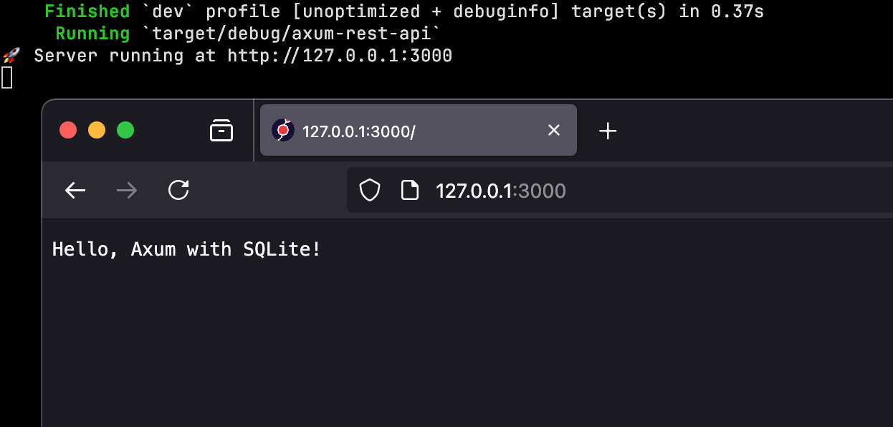

# Axum REST API

Example Rust REST API built with Axum and SQLx. 🤝

 

**Features:**

- SQLite database
- SQLx for database integration
- Fully managed migrations
- Fetch all users or a single user by ID
- Add new users via POST requests
- Delete users via DELETE requests

Easily interact with the API using cURL or a browser.
